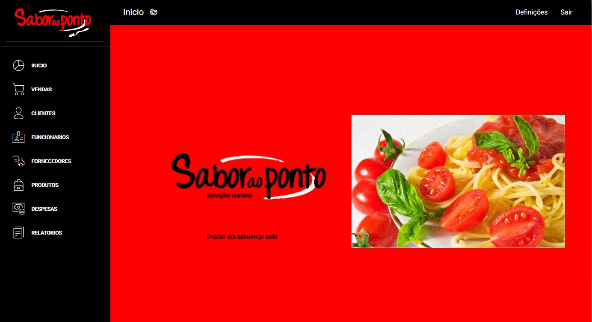

# RaidWEB - Dashboard
Dashboard em PHP, desenvolvido como TCC no 3º ano do ensino médio técnico de informática no UNASP-HT, pelos alunos Pedro Lanatti e Samuel Cezar.

## Requerimentos
* [Pacote de Servidores XAMPP](https://www.apachefriends.org/pt_br/index.html)

#### Ou qualquer outro
* Servidor Web Apache
* Banco de dados MySQL

## Como rodar ? 

#### Copie o link do repositório do Git e faça a clonagem 
```
git clone https://github.com/pedrolf30/RaidWEB.git
```

#### Mova os arquivos para a pasta do web server 
```
* Linux: var/www
* Windows: C:\xampp\htdocs\PASTA_DO_PROJETO
```

#### Importar banco de dados
```
Importar arquivo db.sql que está na pasta 'Banco de Dados' para o seu sistema de banco de dados MySQL.
```
#### Acessar o localhost pelo browser
```
localhost:8080/
```
